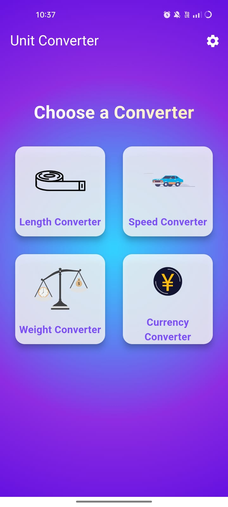
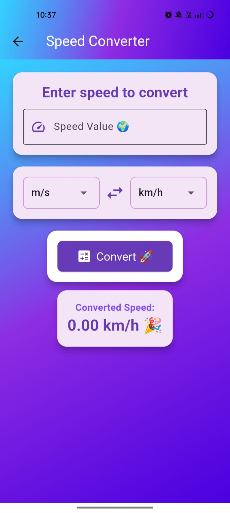

# Unit Converter App

A simple and intuitive Unit Converter app built with Flutter, allowing users to convert between different units of measurement with ease. This app covers multiple categories such as length, weight, volume, temperature, and more.

## Features

- **Unit Categories**: Supports conversions for length, weight, volume, temperature, speed, area, and more.
- **Real-Time Conversion**: Convert units in real time as you type.
- **User-Friendly Interface**: Simple, clean, and responsive UI designed for ease of use.
- **Flutter Framework**: Built with Flutter for smooth performance across Android and iOS.

## Screenshots





## Getting Started

### Prerequisites

- **Flutter SDK**: Make sure you have [Flutter installed](https://flutter.dev/docs/get-started/install).
- **Dart SDK**: Comes bundled with Flutter but make sure it’s up to date.

### Installation

1. **Clone the repository**:
   ```bash
   git clone https://github.com/yourusername/unit_converter_app.git
   cd unit_converter_app

Install dependencies:
bash
Copy code
flutter pub get

Run the app:
bash
Copy code
flutter run
Folder Structure
bash
Copy code
lib/
├── main.dart               # Entry point of the app
├── screens/                # UI screens (e.g., home, conversion screens)
├── models/                 # Data models for unit categories
├── utils/                  # Helper functions and utilities
└── widgets/                # Custom widgets used in the app
Usage
Launch the app and choose a unit category (e.g., Length, Weight).
Enter the value and select the units you want to convert.
The app will display the converted value instantly.

Dependencies
flutter
provider (if used for state management)
intl (for formatting numbers and units)
Contributing
Contributions are welcome! Feel free to submit a pull request or open an issue if you have ideas or find bugs.

Fork the repo
Create a branch for your feature (git checkout -b feature-name)
Commit your changes (git commit -m 'Add new feature')
Push to the branch (git push origin feature-name)
Open a pull request

License
This project is licensed under the MIT License - see the LICENSE file for details.

Contact
For any inquiries, please contact 2200039087@kluniversity.in.
